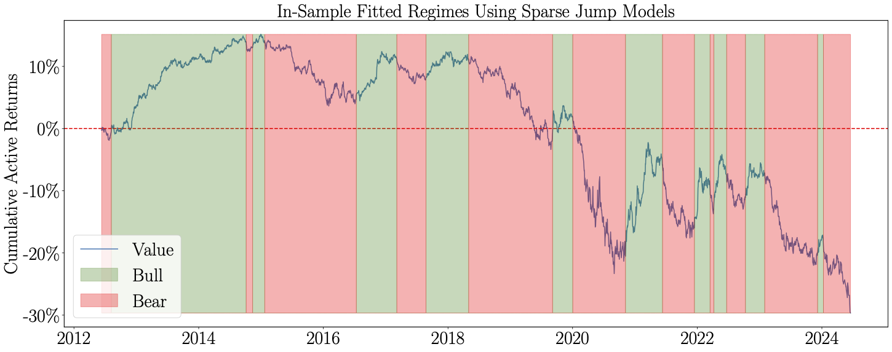

*Note: A description of the use of JMs in this figure can be found in* [Examples](#examples).


# `jumpmodels`: Python Library for Statistical Jump Models


`jumpmodels` is a Python library offering a collection of statistical jump models (JMs), an unsupervised algorithm designed for regime identification in time series data. 
It includes implementations of the original discrete JM, the continuous JM (CJM), and the sparse JM (SJM) with feature selection. 
The library follows a [`scikit-learn`](https://github.com/scikit-learn/scikit-learn)-style API and supports `pandas.DataFrame` for both input and output.


---

- [Installation](#installation)
- [Usage](#usage)
- [Examples](#examples)
- [References and Citations](#references-and-citations)
- [Contributing](#contributing)
- [Credits and Related Repo](#credits-and-related-repo)
- [License](#license)


## Installation

Use the package manager [pip](https://pip.pypa.io/en/stable/) to install:

```bash
pip install ???
```

`jumpmodels` has the following dependencies:

- Python 3
- `numpy` 
- `pandas`
- `scipy`
- `scikit-learn`


All dependencies can be installed with:

```bash
mamba install pandas scikit-learn hmmlearn matplotlib
```

Replace `mamba` with `conda` or `pip` if you haven't installed `mamba`.


- `matplotlib`
- `yfinance`
- `jupyterlab`

## Usage


```python
from jumpmodels.jump import this
# Add more usage examples later
```


## Examples


The figure on top illustrates an example use of the sparse JM, showing the in-sample fitted regimes based on the value factor index’s daily active returns relative to the market. 
Further details are available in Shu and Mulvey (2024), as listed in [References](#factor).


A comprehensive example application using the Nasdaq Composite Price Index series with a simple feature set can be found in the `example/nasdaq` directory.


## References and Citations

Below are articles related to the methodology and applications of JMs. 
If any of them assist your research, please cite the corresponding paper.

### JM Methodology

- **Continuous Statistical Jump Models** (CJM): Aydınhan, A. O., Kolm, P. N., Mulvey, J. M., and Shu, Y. (2024). Identifying patterns in financial markets: Extending the statistical jump model for regime identification. *Annals of Operations Research*. To appear. [[journal](https://link.springer.com/article/10.1007/s10479-024-06035-z)] [[SSRN](https://papers.ssrn.com/abstract=4556048)]


```bibtex
@article{Aydinhan2024CJM,
    title   = {Identifying patterns in financial markets: extending the statistical jump model for regime identification},
    author  = {Afşar Onat Aydınhan and Petter N. Kolm and John M. Mulvey and Yizhan Shu},
    journal = {Annals of Operations Research},
    year    = {2024},
    note    = {To appear},
    doi     = {https://doi.org/10.1007/s10479-024-06035-z},
}
```


- (Original) **Statistical Jump Models**: Nystrup, P., Lindström, E., and Madsen, H. (2020a). Learning hidden Markov models with persistent states by penalizing jumps. *Expert Systems with Applications*, 150:113307. [[journal](https://www.sciencedirect.com/science/article/abs/pii/S0957417420301329)] [[OpenAccess](https://orbit.dtu.dk/files/255194701/Learning_hidden_Markov_models_with_persistent_states_by_penalizing_jumps_ACCEPTED_ESWA.pdf)]


```bibtex
@article{Nystrup2020JM,
    title   = {Learning hidden {Markov} models with persistent states by penalizing jumps},
    author  = {Peter Nystrup and Erik Lindstr{\"o}m and Henrik Madsen},
    journal = {Expert Systems with Applications},
    year    = {2020},
    pages   = {113307},
    volume  = {150},
    doi     = {https://doi.org/10.1016/j.eswa.2020.113307},
}
```


- **Sparse Jump Models**: Nystrup, P., Kolm, P. N., and Lindström, E. (2021). Feature selection in jump models.  *Expert Systems with Applications*, 184:115558.  [[journal](https://www.sciencedirect.com/science/article/pii/S0957417421009647)] [[SSRN](https://papers.ssrn.com/sol3/papers.cfm?abstract_id=3805831)]


```bibtex
@article{nystrup2021SJM,
    title     = {Feature selection in jump models},
    author    = {Peter Nystrup and Petter N. Kolm and Erik Lindstr{\"o}m},
    journal   = {Expert Systems with Applications},
    volume    = {184},
    pages     = {115558},
    year      = {2021},
    doi       = {https://doi.org/10.1016/j.eswa.2021.115558},
}
```


- **Online Inference for JMs**:  Nystrup, P., Kolm, P. N., and Lindström, E. (2020b). Greedy online classification of persistent market states using realized intraday volatility features. *The Journal of Financial Data Science*, 2(3):25–39. [[journal](https://www.pm-research.com/content/iijjfds/2/3/25)] [[OpenAccess](https://backend.orbit.dtu.dk/ws/portalfiles/portal/242396317/Greedy_online_classification_of_persistent_market_states_using_realized_intraday_volatility_features.pdf)]

```bibtex
@article{Nystrup2020onlineJM,
    title   = {Greedy Online Classification of Persistent Market States Using Realized Intraday Volatility Features},
    author  = {Peter Nystrup and Petter N. Kolm and Erik Lindstr{\"o}m},
    journal = {The Journal of Financial Data Science}
    year    = {2020},
    volume  = {2},
    number  = {3},
    pages   = {25--39},
    doi     = {https://doi.org/10.3905/jfds.2020.2.3.025},
}
```


### JM Applications


- **Downside Risk Recution**: Shu, Y., Yu, C., and Mulvey, J. M. (2024a). Downside risk reduction using regime-switching signals: A statistical jump model approach. *Journal of Asset Management*. To appear. [[journal](https://link.springer.com/article/10.1057/s41260-024-00376-x)] [[SSRN](https://ssrn.com/abstract=4719989)]


```bibtex
@article{Shu2024downside,
    title   = {Downside Risk Reduction Using Regime-Switching Signals: A Statistical Jump Model Approach},
    author  = {Shu, Yizhan and Yu, Chenyu and Mulvey, John M.},
    journal = {Journal of Asset Management},
    year    = {2024},
    note    = {To appear},
    doi     = {https://doi.org/10.1057/s41260-024-00376-x},
}
```


- **Dynamic Asset Allocation**: Shu, Y., Yu, C., and Mulvey, J. M. (2024b). Dynamic asset allocation with asset-specific regime forecasts. *Annals of Operations Research*. To appear. [[journal](https://link.springer.com/article/10.1007/s10479-024-06266-0)] [[SSRN](https://ssrn.com/abstract=4864358)]

```bibtex
@article{Shu2024DAA,
    title   = {Dynamic Asset Allocation with Asset-Specific Regime Forecasts},
    author  = {Shu, Yizhan and Yu, Chenyu and Mulvey, John M.},
    journal = {Annals of Operations Research},
    year    = {2024},
    note    = {To appear},
    doi     = {https://doi.org/10.1007/s10479-024-06266-0},
}
```


- <a id="factor"></a> **Dynamic Factor Allocation**: Shu, Y. and Mulvey, J. M. (2024). Dynamic Factor Allocation Leveraging Regime-Switching Signals. [[SSRN](https://papers.ssrn.com/sol3/papers.cfm?abstract_id=4960484)]


```bibtex
@article{Shu2024factor,
    title   = {Dynamic Factor Allocation Leveraging Regime-Switching Signals},
    author  = {Shu, Yizhan and Mulvey, John M.},
    journal = {SSRN},
    year    = {2024},
}
```


## Contributing

Pull requests are welcome. I am happy to discuss any changes with you. 


## Credits and Related Repo

This library builds upon the open-source [code](https://www.sciencedirect.com/science/article/pii/S0957417421009647#appSB) accompanying Nystrup et al. (2021).

The GitHub [Repo](https://github.com/FedericoCortese/GIC-for-SJM) by Federico P. Cortese implements the generalized information criteria (GIC) for high-dimensional SJMs, detailed in Cortese, F. P., Kolm, P. N., and Lindström, E. (2024). Generalized information criteria for high-dimensional sparse statistical jump models [[SSRN](https://papers.ssrn.com/sol3/papers.cfm?abstract_id=4774429)].

The structure of this README file is inspired by the format used in [`cvxpylayers`](https://github.com/cvxgrp/cvxpylayers). 


## License

Our library carries an Apache 2.0 license.


